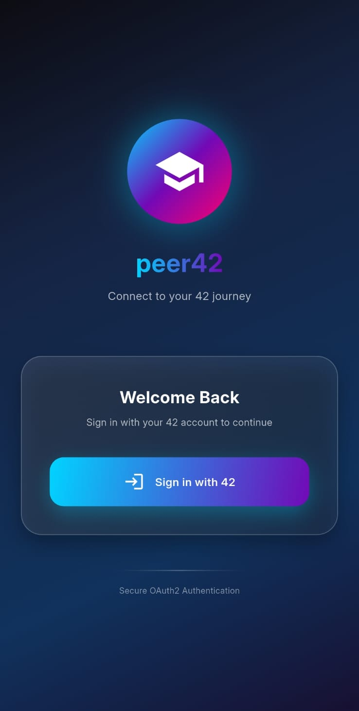
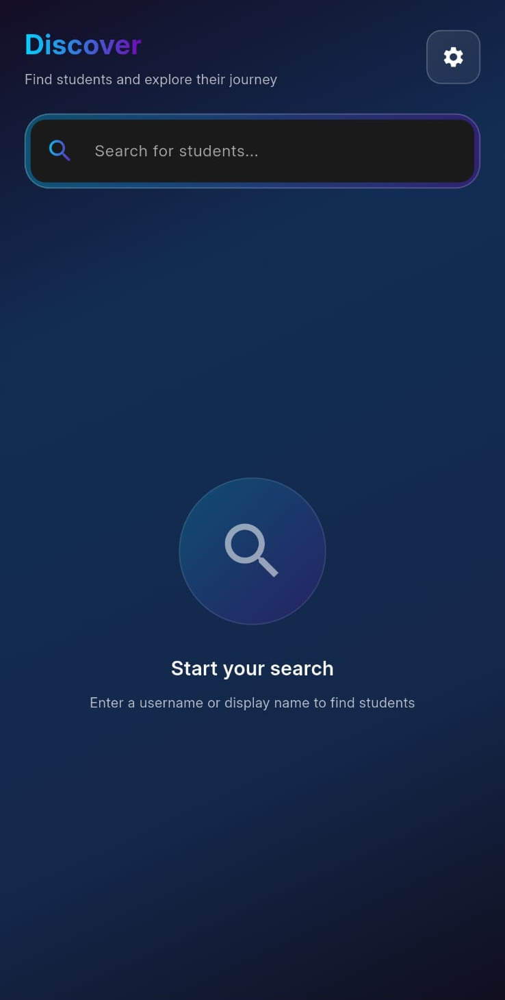
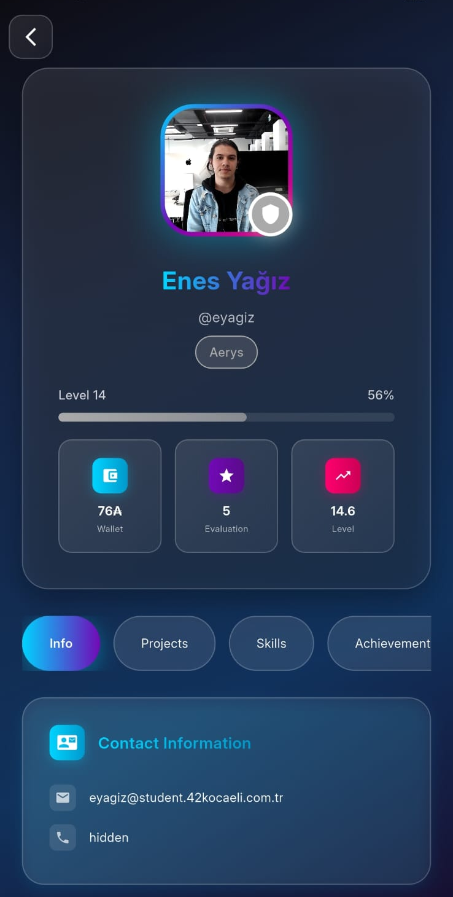
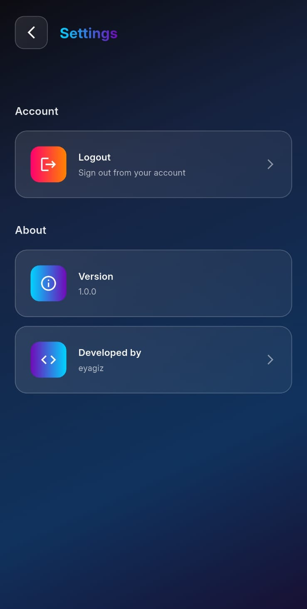

<div align="center">

# Peer42 - 42 Student Explorer 🚀

A modern Flutter mobile application for exploring 42 student profiles, skills, and project achievements using the 42 API.


</div>

## 📱 Features

- **OAuth2 Authentication** - Secure login with 42 API
- **Student Profile Explorer** - Browse detailed student information
- **Project Tracking** - View completed projects and achievements
- **Skill Visualization** - Interactive skill trees and progress tracking
- **Modern UI/UX** - Clean, dark-themed interface with smooth animations
- **Search Functionality** - Find students by login, name, or skills
- **Cross-Platform** - Available for both Android and iOS
- **Settings & Customization** - Personalize your experience

## 📸 Screenshots

| Main Screen | Search Screen | Profile Screen | Settings Screen |
|-------------|---------------|----------------|-----------------|
|  |  |  |  |

## 🎯 Project Goals

This project aims to introduce mobile application development using:
- Mobile programming languages (Dart)
- Modern IDE usage (Android Studio/VS Code)
- Mobile Frameworks (Flutter)
- 42 API integration
- OAuth2 authentication flow

## 🛠️ Tech Stack

- **Framework**: Flutter 3.6+
- **Language**: Dart
- **Authentication**: OAuth2 with 42 API
- **State Management**: Provider
- **UI Components**: Custom Material Design 3
- **Networking**: HTTP package
- **Storage**: SharedPreferences & Secure Storage
- **Deep Linking**: App Links

## 📋 Requirements

### Mandatory Features Implemented:
✅ **Multiple Views** - App has login, search, profile, and settings screens  
✅ **Error Handling** - Comprehensive error handling for network, authentication, and API errors  
✅ **Login Information Display** - Shows user's 42 login information when available  
✅ **User Details** - Displays login, email, level, location, wallet, evaluations, and profile picture  
✅ **Skills Display** - Shows user's skills with level and percentage  
✅ **Projects Display** - Shows completed and failed projects  
✅ **Navigation** - Seamless navigation between all screens  
✅ **Responsive Layout** - Adapts to different screen sizes and orientations  
✅ **42 API Integration** - Uses intra.oauth2 for secure authentication

## 🚀 Installation

### Prerequisites
- Flutter SDK 3.6 or higher
- Dart SDK 3.0 or higher
- Android Studio / Xcode (for iOS)
- 42 API credentials

### Setup Steps

1. **Clone the repository**
   ```bash
   git clone https://github.com/your-username/peer42.git
   cd peer42
   ```

2. **Install dependencies**
   ```bash
   flutter pub get
   ```

3. **Configure 42 API credentials**
   - Create a `.env` file in the root directory
   - Add your 42 API credentials:
   ```env
   CLIENT_ID=your_42_client_id
   CLIENT_SECRET=your_42_client_secret
   REDIRECT_URI=peer42://oauth/callback
   ```

4. **Run the application**
   ```bash
   # Debug mode
   flutter run
   
   # Release mode
   flutter run --release
   ```

## 📱 Download

### Android
- **APK Files**: Available in the `apk_files/` directory
- **Latest Release**: Download the latest APK from the releases section

### iOS
- **IPA Files**: Contact developer for iOS builds
- **TestFlight**: Coming soon

## 🔧 Configuration

### Android Setup
1. Ensure minimum SDK version 21 (Android 5.0)
2. Add deep link intent filters in `android/app/src/main/AndroidManifest.xml`

### iOS Setup
1. Requires iOS 12.0 or higher
2. Configure URL schemes in `ios/Runner/Info.plist`
3. Add required permissions for network access

## 🌟 42 API Integration

The app integrates with the 42 API to provide:
- Secure OAuth2 authentication
- Real-time student data
- Project and evaluation information
- Campus and coalition data
- Achievement tracking

### API Endpoints Used:
- `/oauth/authorize` - Authentication
- `/oauth/token` - Token exchange
- `/v2/me` - Current user information
- `/v2/users/{id}` - User details
- `/v2/users/{id}/projects_users` - User projects

## 🎨 Design Features

- **Modern Dark Theme** - Eye-friendly dark interface
- **Gradient Animations** - Smooth color transitions
- **Glass Morphism** - Modern UI elements with transparency effects
- **Responsive Design** - Adapts to all screen sizes
- **Smooth Animations** - Enhanced user experience with fluid motions

## 🔒 Security & Privacy

- **OAuth2 Flow** - Secure authentication without storing passwords
- **Token Management** - Automatic token refresh and secure storage
- **Privacy First** - No unnecessary data collection
- **Secure Storage** - Sensitive data encrypted locally

## 🧪 Testing

```bash
# Run unit tests
flutter test

# Run integration tests
flutter test integration_test/

# Run with coverage
flutter test --coverage
```

## 🏗️ Building

### Android APK
```bash
flutter build apk --release
```

### iOS IPA
```bash
flutter build ipa --release
```

### For different architectures
```bash
# Split APK by architecture (smaller file sizes)
flutter build apk --release --split-per-abi

# Build for specific architecture
flutter build apk --release --target-platform android-arm64
```

## 🤝 Contributing

1. Fork the repository
2. Create a feature branch (`git checkout -b feature/amazing-feature`)
3. Commit your changes (`git commit -m 'Add amazing feature'`)
4. Push to the branch (`git push origin feature/amazing-feature`)
5. Open a Pull Request

## 📄 License

This project is created for educational purposes as part of the 42 curriculum.

## 👤 Developer

**Enes Yağız**
- 42 Login: `eyagiz`
- GitHub: [@fleizean](https://github.com/fleizean)
- Portfolio: [fleizean.vercel.app](https://fleizean.vercel.app)

## 🙏 Acknowledgments

- **42 School** - For providing the API and project guidelines
- **Flutter Team** - For the amazing framework
- **Material Design** - For design inspiration
- **42 Community** - For feedback and support

---

*Built with ❤️ for the 42 community*
